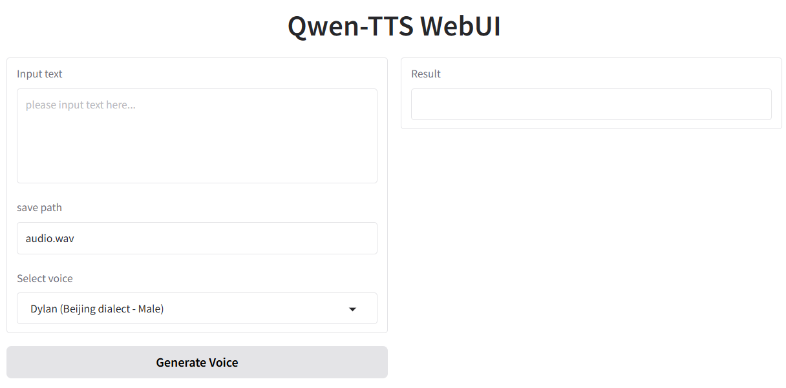

# Qwen-TTS WebUI

A user-friendly Gradio-based web interface for text-to-speech conversion using Qwen-TTS technology.

## Features

- Intuitive web interface for easy text input
- Custom output path specification for generated audio files
- Voice selection with 7 high-quality options: Chelsie, Cherry, Ethan, Serena, Dylan, Jada, and Sunny
- Clean and modern UI design with centered title
- Simple one-click audio generation

## Installation

1. Clone this repository:
   ```bash
   git clone https://github.com/openvino-book/Qwen-TTS-WebUI.git
   cd Qwen-TTS-WebUI
   ```

2. Install required dependencies:
   ```bash
   pip install dashscope gradio
   ```

## Usage

1. Run the application:
   ```bash
   python tts_webui.py
   ```

2. Open your browser and navigate to the provided local URL (typically http://127.0.0.1:7860)

3. Enter the text you want to convert to speech
4. Select your preferred voice from the dropdown menu
5. Specify the output path for the generated audio file
6. Click the "Generate" button to create your audio file


## Configuration

If required by the TTS API, set your [Qwen-TTS API key](https://qwenlm.github.io/blog/qwen-tts/) in the environment variables.

## Screenshots



*Add a screenshot of the application interface here*

## License

This project is licensed under the MIT License - see the LICENSE file for details.

## Acknowledgments

- Qwen-TTS for providing the text-to-speech technology
- Gradio for the web interface framework